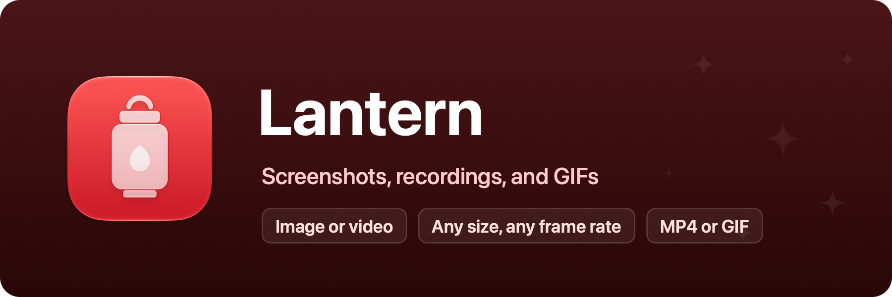

<p align="center">
  
</p>

# Lantern

Screen capture for the Mac: images, recordings, and GIFs. Part of [Domus](https://domus-apps.com).

A lantern is the glazed structure on a roof that lets light into the rooms
below, and the magic lantern was the first device to throw pictures onto a
wall. Lantern does both for your screen: it lets you take what is on it, then
shows it the way you want it shown.

## How it works

Press ⌥⌘S (changeable in Settings) and a capture bar appears at the bottom of
the screen. Pick an image or a recording of the whole display, a single window,
or an area you drag out, then click Capture or Record. A recording is stopped
from the menu bar or with the same shortcut.

Every capture opens in a small editor first. Choose a size (100, 75, 50, or 25
percent, or a custom width), a frame rate for video, and the format: PNG for
images, MP4 or GIF for recordings. Trim a recording with the player's own trim
bar. Save writes to the Desktop (or the folder you pick, or asks each time) and
copies an image to the clipboard as well; Copy puts the result on the clipboard
without saving.

Captures go through ScreenCaptureKit, so Lantern needs the Screen Recording
permission. macOS applies it at launch, which is why a fresh grant asks for a
relaunch. GIFs are encoded by the system with a palette per frame and loop
forever; because GIF timing is counted in hundredths of a second, GIFs play at
up to 30 frames per second.

## Development

```sh
./Scripts/dev.sh      # rebuild-and-relaunch loop
./Scripts/test.sh     # unit tests
./Scripts/bundle.sh   # assemble build/Lantern.app
```

Screen Recording is granted per signature, so test the capture flow with a
bundled build. Requires macOS 26 or later.

## License

MIT, see [LICENSE](LICENSE). Bundled third-party software and its licenses are listed in [THIRD-PARTY-NOTICES.md](THIRD-PARTY-NOTICES.md).
